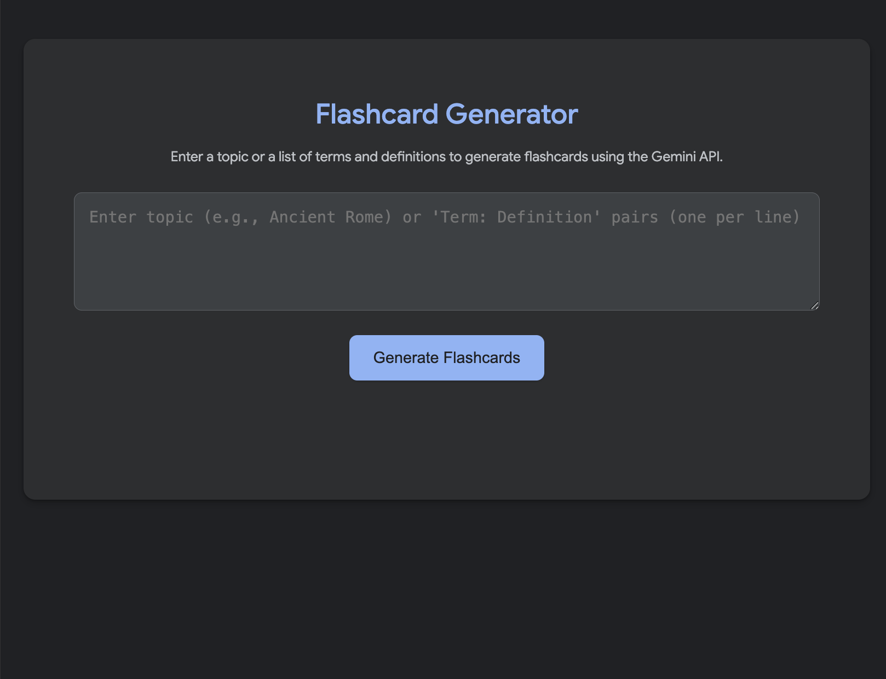

# 🎉 Flashcard Maker

[]()
[]()
[]()

> Instantly create interactive flashcards for any topic with the power of Gemini AI. Learn smarter, not harder! 🤓

---

## 📸 Demo


---

## 🚀 Table of Contents

1. [Features](#-features)  
2. [Installation](#-installation)  
3. [Usage](#-usage)  
4. [Configuration](#-configuration)  
5. [Screenshots](#-screenshots)  
6. [Contributing](#-contributing)  
7. [License](#-license)

---

## ✨ Features

- 🎯 Generate flashcards from a topic or term–definition pairs  
- 🔄 Instantly update cards on the fly  
- 📂 Organize decks and export them  
- 🖼️ Preview cards with a clean, minimal UI  
- 🔐 Secure your API key with environment variables  

---

## 💻 Installation

```bash
# Clone the repo
git clone https://github.com/yourusername/flashcard-maker.git
cd flashcard-maker

# Install dependencies
npm install
```

---

## ⚙️ Configuration

1. Create `.env.local` in the root:
   ```env
   GEMINI_API_KEY=your_gemini_api_key_here
   ```
2. (Optional) Change the default port in `vite.config.ts`.

---

## ▶️ Usage

```bash
# Start dev server
npm run dev
```
- Open your browser at `http://localhost:3000`  
- Enter a topic (e.g., “Quantum Physics”) or paste `Term: Definition` pairs  
- Click **Generate Flashcards** and watch the magic! ✨

---

## 🖼️ Screenshots

| Landing Page               | Generated Flashcards          |
|:---------------------------|:-----------------------------:|
|  |   |

---

## 🤝 Contributing

1. Fork this repo  
2. Create a feature branch (`git checkout -b feature/YourFeature`)  
3. Commit your changes (`git commit -m 'Add new feature'`)  
4. Push to the branch (`git push origin feature/YourFeature`)  
5. Open a Pull Request

---

## 📝 License

This project is released under the **CC0 1.0 Universal** license. See [LICENSE](LICENSE) for details.

---

> Made with ❤️ by [Your Name](https://github.com/yourusername)
